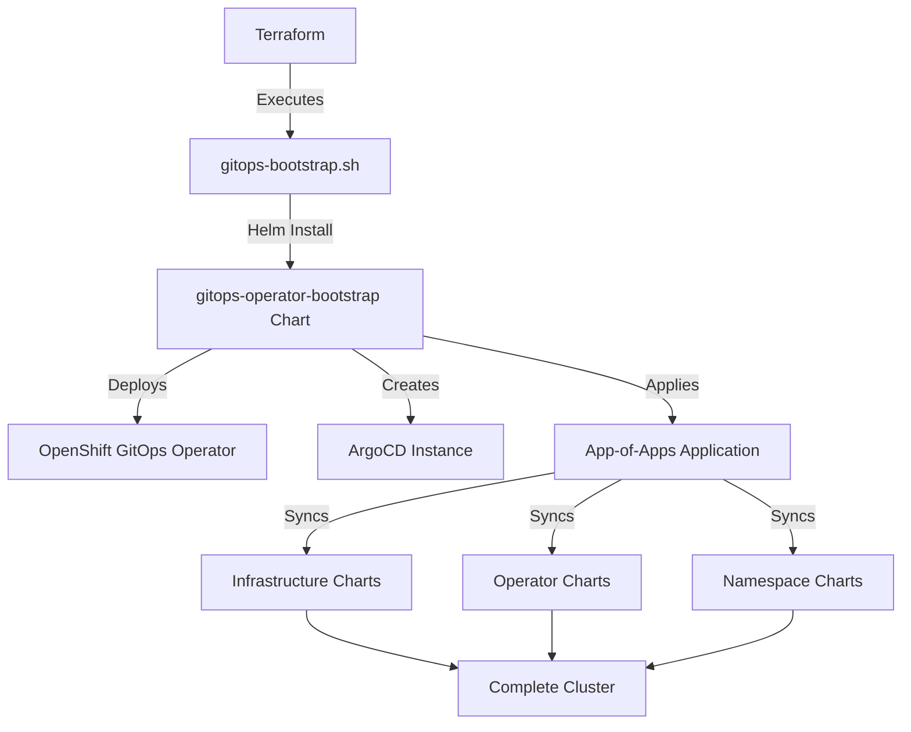

# ROSA HCP Helm Charts

[](https://github.com/abavage/helm-gitops/actions/workflows/release.yml)
[](https://github.com/abavage/helm-gitops/actions/workflows/lint-test.yaml)

## Overview

This repository contains the Helm charts used to bootstrap Red Hat OpenShift Service on AWS (ROSA) Hosted Control Plane (HCP) clusters using a GitOps-driven approach with ArgoCD.

These charts are responsible for deploying and configuring all core cluster services and Operators required for a production-ready OpenShift environment.

## Quick Start

### Add the Helm Repository

```bash
helm repo add rosa-gitops https://abavage.github.io/helm-gitops/
helm repo update
```

### Bootstrap a New Cluster

The typical bootstrap sequence is initiated by Terraform, but can also be done manually:

```bash
# Install the Openshift-Gitops Operator and supporting configuration
helm install gitops-operator rosa-gitops/gitops-operator \
  --set csv=""
```

```bash
# Install the bootstrap chart
helm install gitops-operator-bootstrap rosa-gitops/gitops-operator-bootstrap \
  --namespace openshift-gitops \
  --create-namespace \
  --set repoURL=https://abavage.github.io/helm-gitops/ \
  --set appOfAppsVersion=0.0.3 \
  --set clusterConfigrepoURL=https://github.com/your-org/rosa-helm-config.git \
  --set infrastructureGitPath=prod/your-cluster/infrastructure.yaml \
  --set cluster_name=your-cluster
```

This will:
1. Install the OpenShift GitOps Operator
2. Create the ArgoCD instance
3. Deploy the root "App of Apps" application
4. Synchronize all infrastructure components

## Available Charts

### Core GitOps Charts

| Chart | Version | Description |
|-------|---------|-------------|
| [gitops-operator-bootstrap](charts/gitops-operator-bootstrap/) | 0.0.21 | Entry point for cluster bootstrap - installs GitOps operator and App-of-Apps |
| [gitops-operator](charts/gitops-operator/) | 0.0.4 | Installs the OpenShift GitOps Operator |
| [gitops-bootstrap](charts/gitops-bootstrap/) | 0.0.1 | Alternative bootstrap chart with private Git repository support |
| [app-of-apps](charts/app-of-apps/) | 0.0.3 | Meta-chart implementing the App-of-Apps pattern for infrastructure |
| [renamed-namespace-app-of-apps](charts/renamed-namespace-app-of-apps/) | 0.0.1 | App-of-Apps for tenant namespace provisioning |

### Namespace & Configuration

| Chart | Version | Description |
|-------|---------|-------------|
| [namespaces](charts/namespaces/) | 0.0.5 | Creates namespaces with RBAC, ResourceQuotas, LimitRanges, and NetworkPolicies |
| [openshift-cluster-config](charts/openshift-cluster-config/) | 0.0.1 | Cluster-wide configuration settings |

### OpenShift Operators

| Chart | Version | Description |
|-------|---------|-------------|
| [openshift-aap](charts/openshift-aap/) | 0.0.19 | Ansible Automation Platform Operator |
| [openshift-efs](charts/openshift-efs/) | 0.0.1 | AWS EFS CSI Driver for persistent storage |
| [openshift-external-secrets](charts/openshift-external-secrets/) | 0.0.15 | External Secrets Operator for AWS Secrets Manager integration |
| [openshift-ingress](charts/openshift-ingress/) | 0.0.1 | Ingress controller configuration |
| [openshift-logging](charts/openshift-logging/) | 0.0.1 | Logging operator with CloudWatch forwarding |
| [openshift-oadp](charts/openshift-oadp/) | 0.0.1 | OpenShift API for Data Protection (backup/restore) |
| [openshift-pipelines](charts/openshift-pipelines/) | 0.0.1 | Tekton Pipelines Operator for CI/CD |

### Infrastructure & Monitoring

| Chart | Version | Description |
|-------|---------|-------------|
| [aws-privateca-issuer](charts/aws-privateca-issuer/) | 1.8.1 | AWS Private CA integration for cert-manager |
| [cluster-monitoring](charts/cluster-monitoring/) | 0.0.18 | Platform monitoring via AWS SNS |
| [helper-status-checker](charts/helper-status-checker/) | 4.0.10 | Operator deployment status verification |

### Test Applications

| Chart | Version | Description |
|-------|---------|-------------|
| [test-app](charts/test-app/) | 0.0.11 | Full-featured test application with storage and secrets |
| [test-app-1](charts/test-app-1/) | 0.0.1 | Minimal test application |

## Architecture

### Bootstrap Flow

The cluster bootstrap follows this GitOps-driven workflow:



**Flow Details:**

1. **Terraform Initiation**: Terraform begins the bootstrap process with cluster-specific variables (region, AWS account, etc.)
2. **Script Execution**: Terraform executes [`gitops-bootstrap.sh`](https://github.com/VG-CTX-StorageUnixServices/awsvicgovprd01-rosa-terraform/blob/main/scripts/gitops-bootstrap.sh) via the [Scott Winkler Shell Provider](https://registry.terraform.io/providers/scottwinkler/shell/latest/docs/resources/shell_script_resource)
3. **Bootstrap Chart Installation**: The script installs the `gitops-operator-bootstrap` chart
4. **ArgoCD Deployment**: The bootstrap chart deploys the OpenShift GitOps Operator and creates the central ArgoCD instance
5. **App-of-Apps Creation**: The bootstrap chart applies the root "App of Apps" application to ArgoCD
6. **Infrastructure Sync**: ArgoCD synchronizes and deploys all core operators and configurations

### Multi-Source GitOps Pattern

This repository implements ArgoCD's **multi-source application** feature, which separates chart templates from cluster-specific configuration:

```yaml
# Example from gitops-operator-bootstrap
sources:
  - repoURL: https://abavage.github.io/helm-gitops/
    chart: app-of-apps
    targetRevision: 0.0.3
    helm:
      valueFiles:
        - $values/prod/rosaprd01/infrastructure.yaml
  - repoURL: https://github.com/your-org/rosa-helm-config.git
    targetRevision: main
    ref: values
```

**Components:**

- **Chart Source** (this repository): Contains the master Helm chart templates, identical across all clusters
- **Values Source** ([rosa-helm-config repository](https://github.com/VG-CTX-StorageUnixServices/awsvicgovprd01-rosa-helm-config)): Contains cluster-specific values files organized by region and name (e.g., `prod/rosaprd01/infrastructure.yaml`)

**Benefits:**

- **Consistency**: All clusters use identical base charts, ensuring a consistent platform
- **Customization**: Cluster-specific configuration (AWS account IDs, regions, versions) managed separately
- **Maintainability**: Update a single cluster's configuration without modifying source charts
- **Version Control**: Different operator versions per cluster without chart drift

### Chart Design Philosophy

Charts in this repository are **intentionally lightweight**:

- Minimal default values in `values.yaml` files
- Configuration injected from external values repositories during ArgoCD sync
- Templates designed for reusability across environments
- Separation of concerns: what to deploy (charts) vs. how to configure (values)

## Development

### Prerequisites

- Helm 3.x
- Python 3.x (for chart-testing)
- [chart-testing (ct)](https://github.com/helm/chart-testing)

### Linting Charts

```bash
# Lint all changed charts
ct lint --target-branch main

# Lint specific chart
ct lint --charts charts/gitops-operator-bootstrap
```

### Testing Locally

```bash
# Template a chart with custom values
helm template my-release charts/gitops-operator-bootstrap \
  -f /path/to/custom-values.yaml

# Dry-run against a cluster
helm install my-release charts/gitops-operator-bootstrap \
  --dry-run --debug \
  -f /path/to/custom-values.yaml
```

### Releasing Charts

Charts are automatically packaged and released to GitHub Pages when changes are pushed to the `main` branch:

1. Update the `version` field in `Chart.yaml`
2. Commit and push to a feature branch
3. Create a pull request (triggers lint/test workflow)
4. Merge to `main` (triggers release workflow)
5. Charts are published to `https://abavage.github.io/helm-gitops/`

## Contributing

1. Make changes in a feature branch
2. Update the chart version in `Chart.yaml`
3. Ensure charts pass linting: `ct lint --charts charts/<chart-name>`
4. Create a pull request
5. Once merged, charts are automatically released

## Documentation

Each chart has comprehensive documentation in its respective directory:

- Installation instructions
- Configuration parameters
- Example usage
- Troubleshooting guides

See individual chart READMEs in the `charts/` directory for detailed information.

## Related Repositories

- [rosa-helm-config](https://github.com/VG-CTX-StorageUnixServices/awsvicgovprd01-rosa-helm-config) - Cluster-specific values and configuration
- [rosa-terraform](https://github.com/VG-CTX-StorageUnixServices/awsvicgovprd01-rosa-terraform) - Terraform modules for ROSA cluster provisioning

## License

This repository is maintained for internal use. See individual charts for license information.
