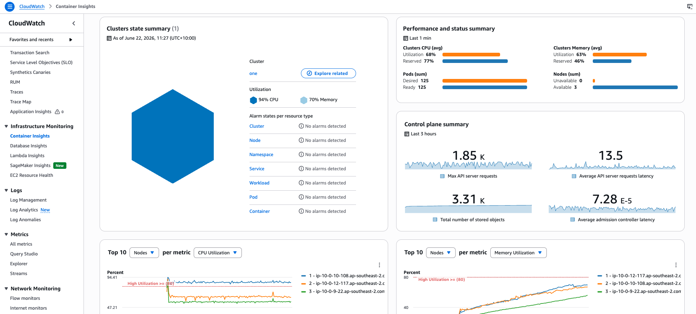
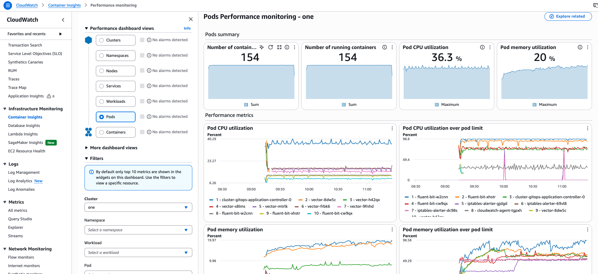

# Amazon CloudWatch Observability

Helm chart for deploying [Amazon CloudWatch Observability](https://aws.amazon.com/cloudwatch/) on OpenShift (ROSA). It installs the CloudWatch Agent Operator, CloudWatch Agent, Fluent Bit, and supporting components to collect cluster metrics, container logs, and Application Signals telemetry into AWS CloudWatch.

This chart is a customized fork of the upstream [AWS Helm chart](https://github.com/aws-observability/helm-charts/tree/main/charts/amazon-cloudwatch-observability) (chart version `0.0.4`).

## Deployment

The chart is deployed via an Argo CD **multi-source application**. Chart templates live in this repository; cluster-specific values are supplied from the cluster's `infrastructure.yaml` file in the [rosa-helm-config](https://github.com/VG-CTX-StorageUnixServices/awsvicgovprd01-rosa-helm-config/tree/main) repository (for example, `prod/rosaprd01/infrastructure.yaml`).

Resources are installed into the `amazon-cloudwatch` namespace.

## AWS IAM Role with Service Account
The following AWS IAM Role (with) Service Account (IRSA) is mandatory for the application to tightly integrate with CloudWatch.


### Set the working variables
```bash
export AWS_ACCOUNT_ID=$(aws sts get-caller-identity --query Account --output text)
export OIDC_PROVIDER=$(oc get authentication.config.openshift.io cluster -ojson | jq -r .spec.serviceAccountIssuer | sed 's/https:\/\///')
export CLUSTER_NAME=<cluster-name>
```

### Create the trustpolicy
```bash
$ cat <<EOF > ./trust.json
{
    "Version": "2012-10-17",
    "Statement": [
        {
            "Effect": "Allow",
            "Principal": {
                "Federated": "arn:aws:iam::${AWS_ACCOUNT_ID}:oidc-provider/${OIDC_PROVIDER}"
            },
            "Action": "sts:AssumeRoleWithWebIdentity",
            "Condition": {
                "StringEquals": {
                    "${OIDC_PROVIDER}:sub": [
                        "system:serviceaccount:amazon-cloudwatch:cloudwatch-agent"
                    ]
                }
            }
        }
    ]
}
EOF
```

### Create the policy
```bash
$ cat <<EOF > ./policy.json
{
    "Version": "2012-10-17",
    "Statement": [
        {
            "Sid": "allowCloudWatch",
            "Effect": "Allow",
            "Resource": "arn:aws:logs:*:*:*",
            "Action": [
                "logs:CreateLogGroup",
                "logs:CreateLogStream",
                "logs:DescribeLogGroups",
                "logs:DescribeLogStreams",
                "logs:PutLogEvents",
                "logs:PutRetentionPolicy"
            ]
        },
        {
            "Sid": "allowDescribe",
            "Effect": "Allow",
            "Resource": "*",
            "Action": [
                "ec2:DescribeTags",
                "ec2:DescribeVolumes"
            ]
        }
    ]
}
EOF

$ aws iam create-policy --policy-name amazoncloudwatchobservability --policy-document file://policy.json
```

### Create the role, assign the policy and trust policy

```bash
$ aws iam create-role --role-name "${CLUSTER_NAME}-amazoncloudwatchobservability" --assume-role-policy-document file://trust.json 
$ POLICY_ARN=$(aws iam list-policies --query 'Policies[?PolicyName==`amazoncloudwatchobservability`].Arn' --output text)
$ aws iam attach-role-policy --role-name "${CLUSTER_NAME}-amazoncloudwatchobservability" --policy-arn "${POLICY_ARN}"

```

## Required Parameters

The following values **must** be provided via `infrastructure.yaml`. The chart will fail to render if any are missing or empty.

| Parameter | Description | Mandatory |
|-----------|-------------|-----------|
| `roleArn` | IAM role ARN assumed by the CloudWatch Agent service account for publishing metrics and logs to CloudWatch | true |
| `clusterName` | Name of the cluster; used as the Container Insights and Application Signals cluster identifier, and in CloudWatch log group paths | true |
| `region` | AWS region where CloudWatch data is sent (for example, `ap-southeast-2`); also selects region-appropriate container images | true |

### Example `infrastructure.yaml` entry

```yaml
  - chart: amazon-cloudwatch-observability
    namespace: amazon-cloudwatch
    values:
      roleArn: arn:aws:iam::123456789012:role/rosa-cloudwatch-agent
      clusterName: rosaprd01
      region: ap-southeast-2
```

### How required parameters are used

- **`roleArn`** — Annotates the CloudWatch Agent service account with `eks.amazonaws.com/role-arn`, enabling IRSA-style credential federation so the agent can write to CloudWatch without static credentials.
- **`clusterName`** — Populates Container Insights log groups (`/aws/containerinsights/<clusterName>/...`), Application Signals `hosted_in`, and OTEL resource attributes.
- **`region`** — Sets the CloudWatch Agent region, Fluent Bit output endpoints, and image registry selection (including GovCloud and China region overrides via `repositoryDomainMap`).

## Components

When deployed with default chart values (`k8sMode: ROSA`), the following are installed:

| Component | Purpose |
|-----------|---------|
| CloudWatch Agent Operator | Manages `AmazonCloudWatchAgent` custom resources and admission webhooks |
| CloudWatch Agent (DaemonSet) | Node-level metrics, Container Insights, and Application Signals collection |
| CloudWatch Agent (Deployment) | Cluster-level metrics scraper (`cloudwatch-agent-cluster-scraper`) |
| Fluent Bit (DaemonSet) | Ships container application, host, and dataplane logs to CloudWatch Logs |
| DCGM Exporter (DaemonSet) | NVIDIA GPU metrics on GPU instance types |
| Neuron Monitor (DaemonSet) | AWS Trainium/Inferentia metrics on supported instance types |

The following pipelines are enabled by default:

- **Container Insights** (`containerInsights.enabled: true`) — Legacy Kubernetes metrics via the CloudWatch Agent.
- **Application Signals** (`applicationSignals.enabled: true`) — Application performance monitoring via traces and metrics.
- **Container logs** (`containerLogs.enabled: true`) — Fluent Bit log shipping.

**OTEL Container Insights** (`otelContainerInsights.enabled: false` by default) is an alternative metrics pipeline using node-exporter and kube-state-metrics. Enable it in `infrastructure.yaml` if required.

## ROSA-specific configuration

With `k8sMode: ROSA` (the default), the chart additionally creates:

- OpenShift Security Context Constraints (SCC) and bindings for the CloudWatch Agent
- ROSA-specific security context and `RUN_IN_ROSA` environment variable on agent pods

## Optional configuration

Most settings have sensible defaults in `values.yaml`. Override any of them in `infrastructure.yaml` alongside the required parameters. Common overrides include:

| Parameter | Default | Description |
|-----------|---------|-------------|
| `k8sMode` | `ROSA` | Platform mode; also supports `EKS` and `K8S` |
| `containerInsights.enabled` | `true` | Legacy Container Insights metrics pipeline |
| `applicationSignals.enabled` | `true` | Application Signals (APM) pipeline |
| `containerLogs.enabled` | `true` | Fluent Bit container log collection |
| `otelContainerInsights.enabled` | `false` | OTEL-based Container Insights pipeline |
| `dcgmExporter.enabled` | `true` | NVIDIA GPU metrics exporter |
| `neuronMonitor.enabled` | `true` | AWS Neuron metrics exporter |

See `values.yaml` for the full list of configurable values.

## Verification

After Argo CD syncs the application, confirm the deployment:

```bash
# Namespace and operator
oc get pods -n amazon-cloudwatch

# CloudWatch Agent custom resources
oc get amazoncloudwatchagents -n amazon-cloudwatch

# Fluent Bit log collection
oc get daemonset -n amazon-cloudwatch -l k8s-app=fluent-bit

# CloudWatch agent daenonset
oc get daemonset -n amazon-cloudwatch -l app.kubernetes.io/component=amazon-cloudwatch-agent
```

In the AWS Console, look for log groups under `/aws/containerinsights/<clusterName>/` and metrics in the CloudWatch Container Insights dashboard for the configured region.

## CloudWatch Sample 




## Upstream reference

- [AWS CloudWatch Observability Helm chart](https://github.com/aws-observability/helm-charts/tree/main/charts/amazon-cloudwatch-observability)
- [Amazon CloudWatch Observability documentation](https://docs.aws.amazon.com/AmazonCloudWatch/latest/monitoring/ContainerInsights.html)
